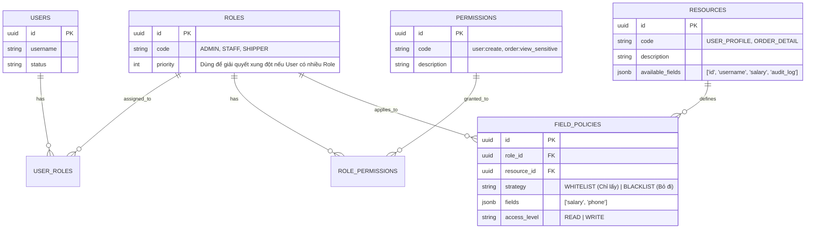

# Thiết Kế Hệ Thống Phân Quyền Động & Bảo Mật Dữ Liệu (Dynamic Security Model)

**Ngày tạo:** 04/02/2026  
**Dự án:** FlashMile  
**Mục tiêu:** Xây dựng cơ chế phân quyền linh hoạt, tách biệt logic kiểm tra quyền ra khỏi Business Logic, hỗ trợ phân quyền hành động (Functional) và phân quyền hiển thị dữ liệu (Data/Field Level).

---

## 1. Tổng quan & Triết lý

### Vấn đề của cách tiếp cận truyền thống
*   **Hard-coded Roles:** Logic như `if (user.isAdmin())` nằm rải rác trong Codebase.
*   **Data Leakage / Over-fetching:** Một API trả về cùng một DTO cho cả Admin và User thường, dẫn đến việc User thường nhận được dữ liệu họ không nên thấy (hoặc Frontend phải tự ẩn đi - không an toàn).
*   **Maintenance Nightmare:** Mỗi khi thay đổi quyền hạn hoặc muốn ẩn/hiện trường dữ liệu mới, Developer phải sửa code, test và deploy lại.

### Giải pháp đề xuất
Chuyển quyền kiểm soát từ **Code** sang **Database**.
1.  **Functional Security (RBAC Dynamic):** Kiểm tra quyền dựa trên **Permission** (Hành động) thay vì Role.
2.  **Data Security (Dynamic Projection):** Lọc dữ liệu trả về (JSON Response) ngay tại thời điểm runtime dựa trên cấu hình Policy. Code Service luôn trả về Full Data, lớp Security sẽ "cắt gọt" trước khi gửi cho Client.

---

## 2. Mô hình Cơ sở dữ liệu (Database Schema)

Hệ thống sử dụng mô hình **Hybrid RBAC** mở rộng với **Field Policies**.

### Sơ đồ ER (Entity-Relationship)

### Chi tiết các bảng quan trọng

#### 1. Table `resources`
Định danh các loại dữ liệu cần bảo vệ.
*   `code`: Mã định danh duy nhất (VD: `ORDER_DTO`).
*   `available_fields`: Danh sách toàn bộ các trường mà Object này có (dùng để gợi ý trên UI Admin).

#### 2. Table `field_policies`
Bảng trung tâm của Data Projection.
*   `role_id`: Role bị áp dụng chính sách.
*   `resource_id`: Resource đang xét.
*   `strategy`:
    *   `WHITELIST`: Chỉ trả về các trường trong danh sách `fields`.
    *   `BLACKLIST`: Trả về tất cả TRỪ các trường trong danh sách `fields`.
*   `fields`: Mảng JSON chứa tên các trường.

---

## 3. Luồng xử lý (Runtime Flow)

### Kịch bản: Client gọi API `GET /api/orders/1`

1.  **Controller Layer:**
    *   Controller gọi Service.
    *   Service thực hiện logic nghiệp vụ, query DB.
    *   Service trả về `OrderDTO` **đầy đủ dữ liệu** (bao gồm cả giá nhập, lợi nhuận, thông tin nhạy cảm).
    *   Controller được đánh dấu annotation: `@ResourceCode("ORDER_DETAIL")`.

2.  **Security Interceptor (ResponseBodyAdvice):**
    *   Spring chặn response trước khi ghi ra HTTP Body.
    *   Hệ thống xác định User hiện tại -> Lấy Role (VD: `STAFF`).
    *   Hệ thống lấy Resource Code từ Annotation (`ORDER_DETAIL`).

3.  **Policy Resolution:**
    *   Query (hoặc lấy từ Redis Cache) bảng `field_policies` với cặp khóa `(Role=STAFF, Resource=ORDER_DETAIL)`.
    *   Kết quả: `Strategy: BLACKLIST`, `Fields: ["importPrice", "profit"]`.

4.  **Data Serialization (Jackson Filter):**
    *   Hệ thống áp dụng Dynamic Filter của Jackson lên object `OrderDTO`.
    *   Các trường `importPrice` và `profit` bị loại bỏ khỏi JSON.

5.  **Client:**
    *   Nhận được JSON sạch, chỉ chứa thông tin được phép xem.

---

## 4. Ví dụ Dữ liệu Minh họa

**Resource:** `USER_PROFILE` (Full fields: `id, username, email, phone, salary, kpi_score`)

| Role | Strategy | Configured Fields | Kết quả trả về cho Client |
| :--- | :--- | :--- | :--- |
| **ADMIN** | `BLACKLIST` | `[]` (Rỗng) | Full fields (`salary`, `kpi`...). |
| **HR** | `WHITELIST` | `["id", "username", "salary", "kpi_score"]` | Thấy lương, KPI nhưng ẩn `phone`, `email` (nếu không cần thiết). |
| **GUEST**| `WHITELIST` | `["id", "username"]` | Chỉ thấy thông tin public. |

---

## 5. Lộ trình Triển khai (Implementation Roadmap)

1.  **Phase 1: Foundation (Cơ sở hạ tầng)**
    *   Setup Spring Security.
    *   Tạo các Entity: Role, Permission, User.
    *   Implement `UserDetailsService`.

2.  **Phase 2: Data Projection Core**
    *   Tạo Entity: `Resource`, `FieldPolicy`.
    *   Tạo Annotation `@ResourceCode`.
    *   Implement `ResponseBodyAdvice` để chặn response.
    *   Config `SimpleBeanPropertyFilter` của Jackson.

3.  **Phase 3: Caching & Performance**
    *   Cache các Policy vào Redis để không query DB mỗi request.
    *   Xử lý trường hợp Nested Object (Object lồng nhau).

4.  **Phase 4: Admin UI**
    *   API CRUD cho Resources và Policies.
    *   Giao diện kéo thả để Admin chọn Role -> Tick chọn các field được xem.
